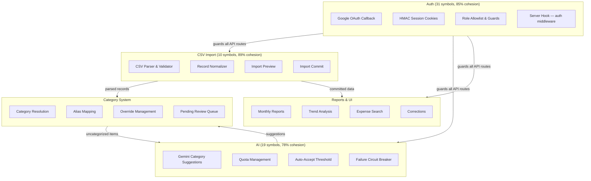
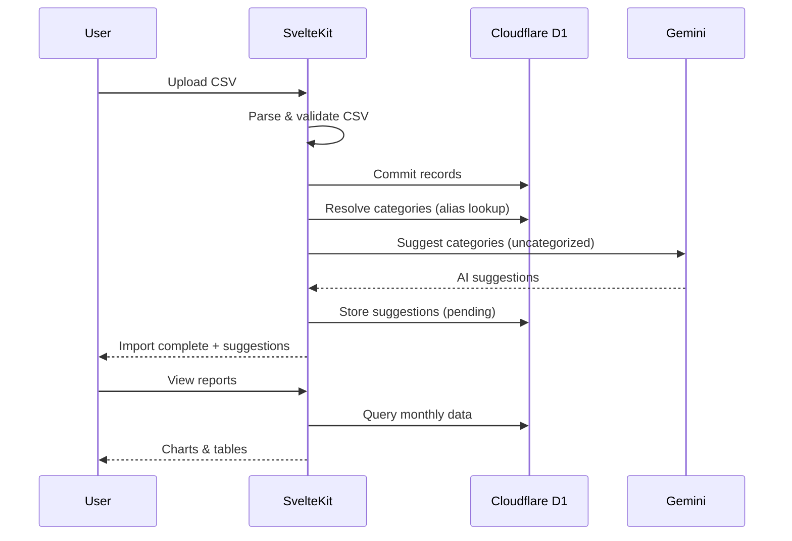

# Architecture — home-flow

> Auto-generated from GitNexus knowledge graph (490 symbols, 768 relationships, 28 execution flows).

## Overview

**home-flow** is a household expense tracking app. Users import CSV bank statements, the system parses and categorizes transactions (with AI-assisted suggestions via Gemini), and provides monthly reports with charts.

| Layer | Tech |
|-------|------|
| Frontend | Svelte 5 + SvelteKit 2, Tailwind CSS + DaisyUI, Chart.js |
| Backend | SvelteKit server routes (API + SSR) |
| Auth | HMAC-signed session cookies, Google OAuth, role-based allowlist |
| Database | Cloudflare D1 (SQLite) |
| AI | Google Gemini (category suggestions, quota-managed) |
| Deploy | Cloudflare Workers (`@sveltejs/adapter-cloudflare`) |
| Testing | Vitest (unit), Playwright (e2e) |

## Functional Areas



## Key Execution Flows

### 1. CSV Import → AI Suggestions (5 steps)
The main import pipeline. User uploads CSV, system parses → normalizes → commits → triggers AI category suggestions.

```
POST /api/import/commit
  → commitImport()
    → resolveCategoriesForImport()  — match known aliases
      → resolveCategory()           — DB lookup per item
    → generatePostImportSuggestions()
      → suggestCategories()          — Gemini API call
        → recordCall() → ensureCurrentMonth() → getCurrentMonth()
```

### 2. On-Demand AI Suggestion (5 steps)
Direct AI suggestion request from the UI for uncategorized items.

```
POST /api/ai/suggest
  → suggestCategories()
    → recordCall()
      → ensureCurrentMonth()
        → getCurrentMonth()
```

### 3. AI Quota Status Check (4 steps)
Frontend polls to show remaining AI quota.

```
GET /api/ai/status
  → getQuotaStatus()
    → ensureCurrentMonth()
      → getCurrentMonth()
```

### 4. Auth Session Creation (4 steps)
Google OAuth callback creates HMAC-signed session cookie.

```
GET /auth/callback
  → createSessionCookie()
    → hmacSign()
      → getHmacKey()
```

### 5. Category Resolution During Import (4 steps)
Resolves each imported transaction to an existing category via alias matching and DB lookup.

```
POST /api/import/commit
  → commitImport()
    → resolveCategoriesForImport()
      → resolveCategory()
```

## Directory Layout

```
src/
├── lib/
│   ├── server/
│   │   ├── ai/          # Gemini integration, quota, config
│   │   ├── auth/        # Session, allowlist, guards
│   │   ├── category/    # Resolution, alias matching
│   │   ├── csv/         # Parser, validator, normalizer
│   │   └── import/      # Preview, commit, post-import suggestions
│   ├── config/          # Shared configuration
│   └── assets/          # Static assets
├── routes/
│   ├── (app)/           # Authenticated pages
│   │   ├── import/      # CSV upload & history
│   │   ├── reports/     # Monthly & detail views
│   │   ├── settings/    # Category management
│   │   └── corrections/ # Manual corrections
│   ├── api/             # REST API endpoints
│   │   ├── ai/          # suggest, suggestions, status
│   │   ├── categories/  # alias, override, pending, manage
│   │   ├── expenses/    # search, fixed-override
│   │   ├── import/      # upload, preview, commit, history
│   │   └── reports/     # monthly, trend
│   ├── auth/            # OAuth flow (callback, login, logout)
│   └── session/         # Session check
└── hooks.server.ts      # Auth middleware (runs on every request)
```

## Data Flow Summary


